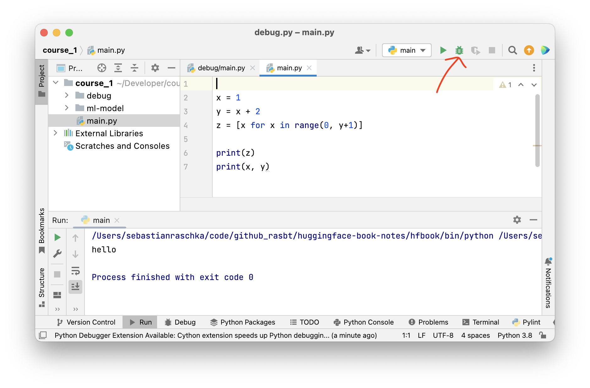
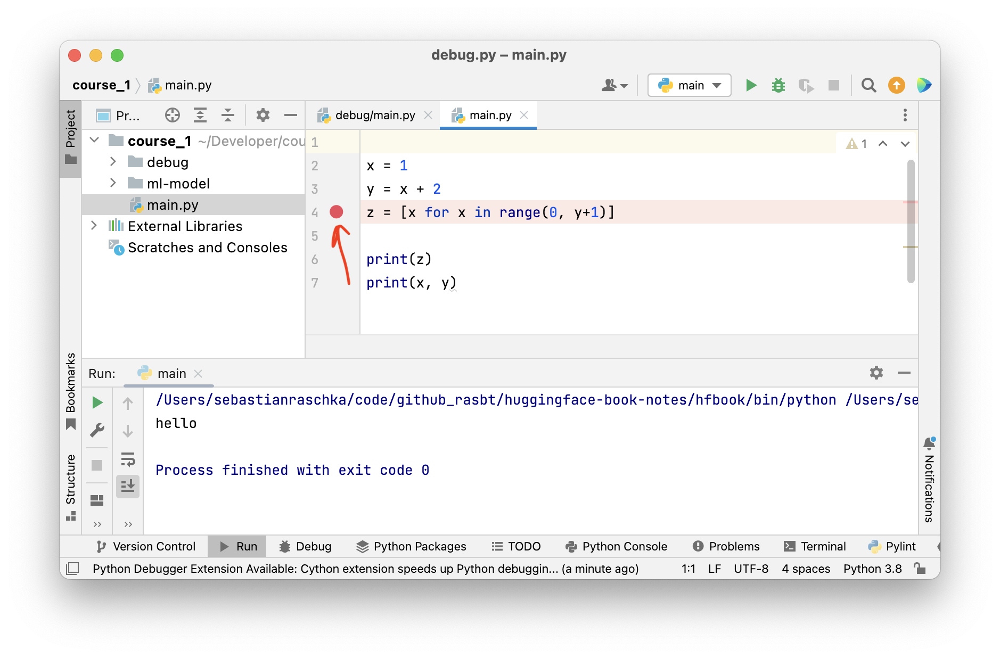
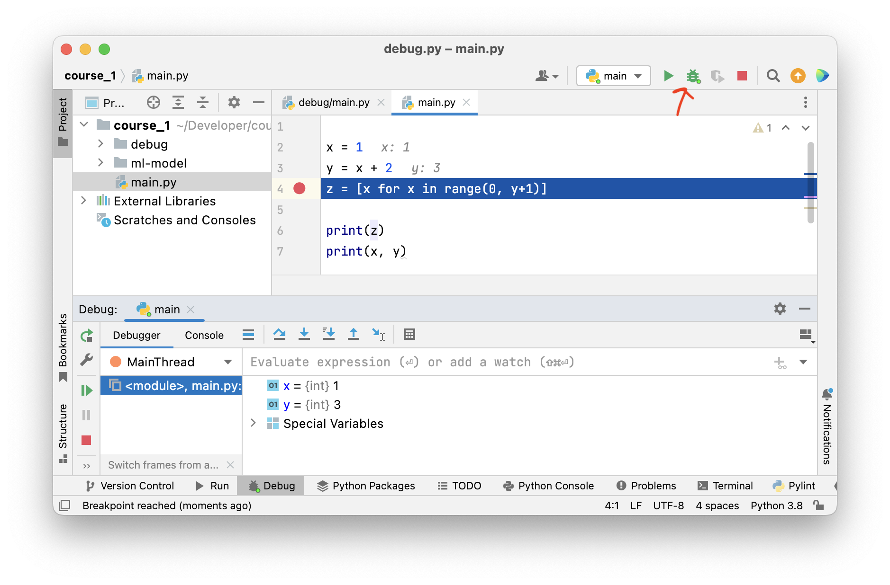
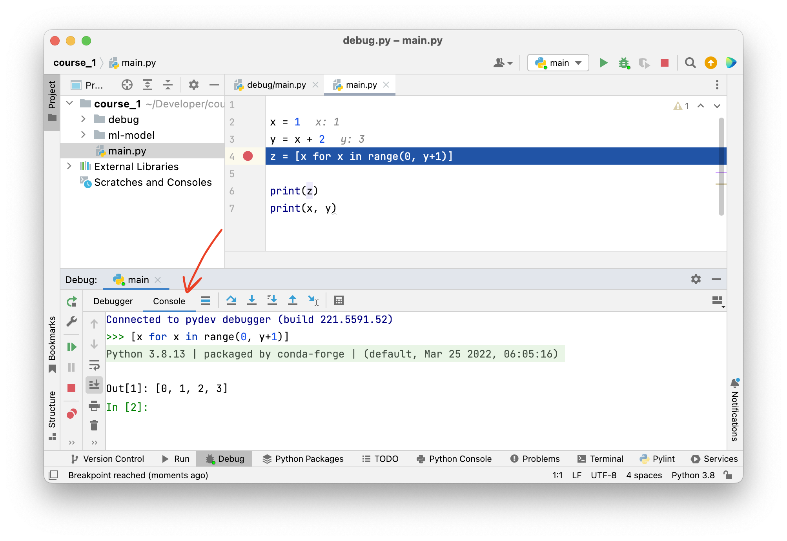
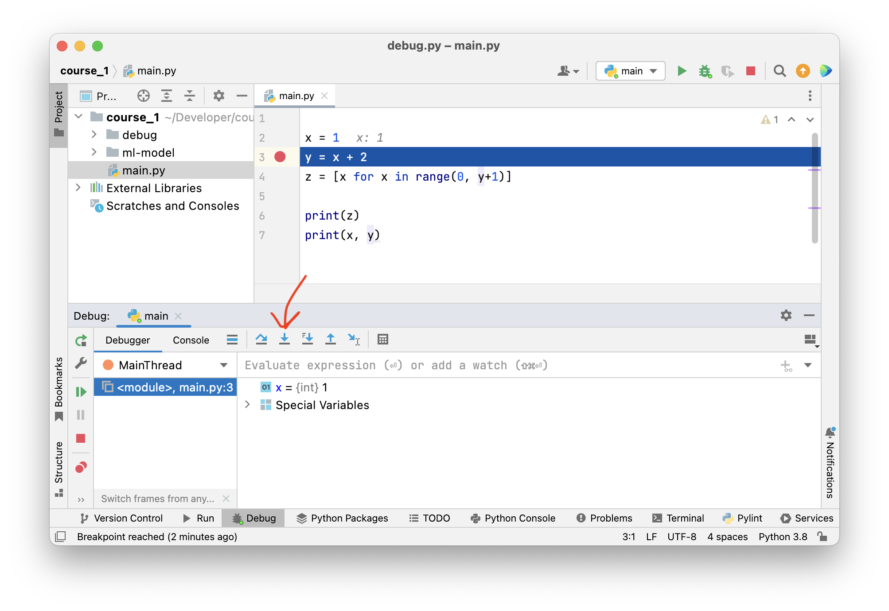
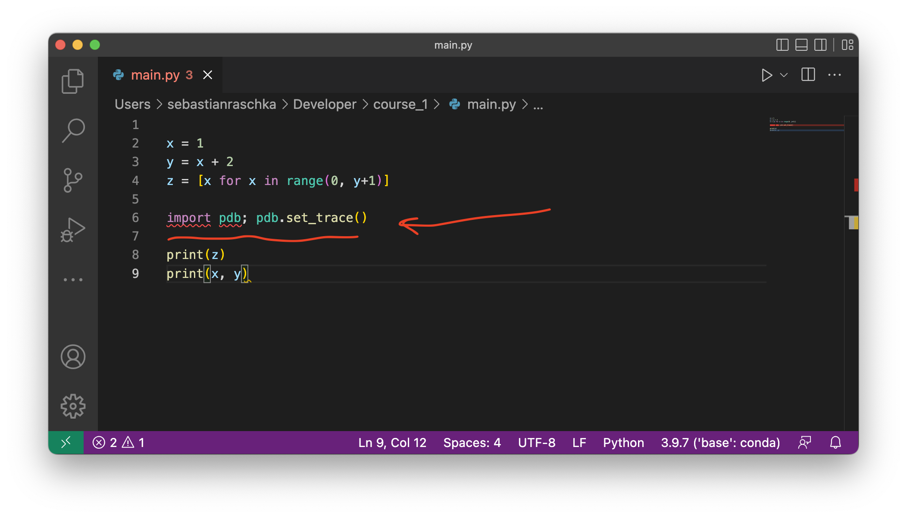
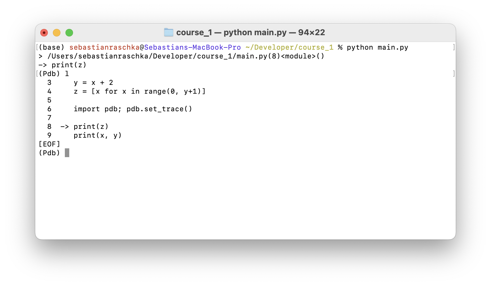
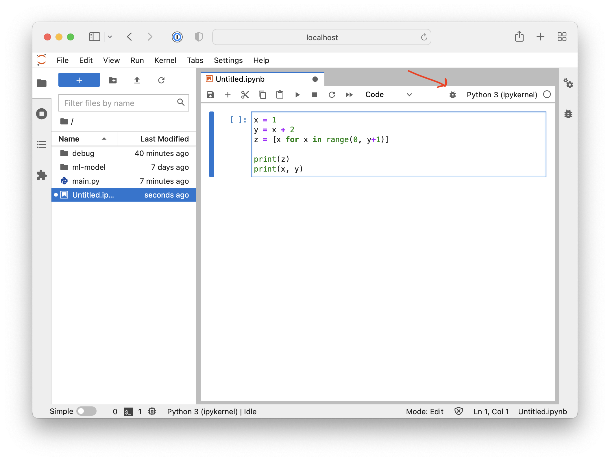
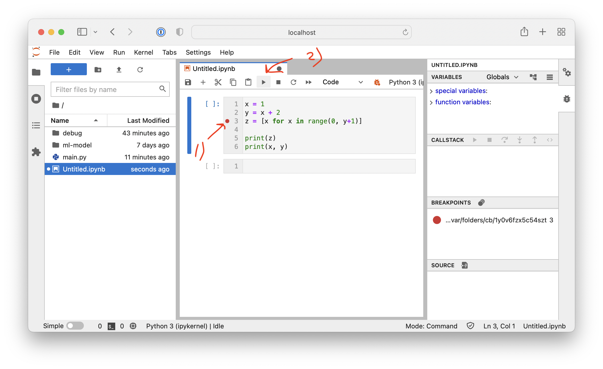

# Debugging Python Code

Learning and using a professional debugging tool is one of the key things you can do to boost your productivity. Sure, you can often get by with the goold old "`print()`" statement approach. However, instead of inserting print statements all over your code, it is often more productive to set a breakpoint, jump into the code, and execute it line by line while inspecting the variables. 

## Debugging in PyCharm

In PyCharm, you can launch the debugger by clicking on the "bug" symbol in the upper right corner:

Then, you can set a breakpoint by clicking next to the line number: a red dot should appear:

Now, if you run the debugger again, the code should stop at the breakpoint, and you should see the variable contents and so forth:

Then, we can go the to the console and explore the code interactively:

## Stepping through your code line by line

Sometimes it is helpful to debug your code line by line. You can do that by setting a breakpoint early in your code and then pressing the "Step into" button repeatedly to advance your code one line at a time:

## Debugging code in the termimal using the built-in `pdb` module

Sometimes you want to debug code on a remote machine or server (more on running code remotely in a future episode) and don't have access to PyCharm. In this case, the [`pdb`](https://docs.python.org/3/library/pdb.html) module in Python's standard library might be a good option. 

For more information on using `pdb`, we recommend seeing the official documentation at https://docs.python.org/3/library/pdb.html, which includes a [section](https://docs.python.org/3/library/pdb.html#debugger-commands) describing the different debugger commands.

The most common debugger commands are:

- `l` or `ll` (longlist) shows the current position in the code
- `h` for help
- `s` to execute the current line
- `q` to quit

## Optional: Debugging in JupyterLab

Note that JupyterLab has a very powerful debugger as well. You can launch it by clicking on the "bug" symbol similar to PyCharm:

The user interface is very similar to PyCharm as well, where you can click next to the line number in order to add a breakpoint. And after setting breakpoints, you can click on "play" to start the debugger:

## Questions or Suggestions?

If you have questions or suggestions, please don't hesitate to reach out to William ([@_willfalcon](https://twitter.com/_willfalcon)) and Sebastian ([@rasbt](https://twitter.com/rasbt)) on Twitter or join our [Slack Channel](https://pytorch-lightning.slack.com/archives/C03GS6MTCCQ). For more episodes, also check out the [Lightning Bits: Engineering for Researchers](http://pytorchlightning.ai/edu/engineering-class).
